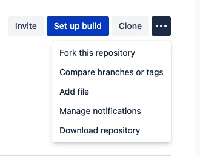

# Trainee Repo

This repo includes both the tasks and tests to familiarise Academy Cohort Trainees with manually deploying resources into AWS.

The tasks set out for you will include creating a Key Pair, EC2 Instance, Subnet and Security Group.

Testing if the resources are made correctly can be done either locally (on your mac) or through an online Jenkins instance which will also let the trainer know your current progress.
<br>
<br>

## Prerequisites
To be able to test locally you will need to have the AWS CLI installed on your mac. This can be achieved with the following code:
```
curl "https://awscli.amazonaws.com/AWSCLIV2.pkg" -o "AWSCLIV2.pkg"
sudo installer -pkg AWSCLIV2.pkg -target /
```
Enter the password for your mac when prompted. Then do the following steps:

* Go onto AWS and navigate to the IAM console
* Go to the "users" of the navigation pane (on the left)
* Click on your user email
* add permissions until your match those shown in the permissions.png file within this repo
* Go to the "Security credentials" tab
* Under "Access keys" select "Create access key"
* Select to show the Secret access key or optionally download the csv file. ((**if you do not store the csv and close the pop-up you will not be able to retrieve the secret key again**))
* Go to your macs terminal and enter the following command, you will then prompted for a series of values enter as explained below.

```
aws configure
```

  * AWS Access Key ID: \<enter the access key ID from aws>
  * AWS Secret Access Key: \<enter the secret access key from aws>
  * Default region name: eu-west-1
  * Default output format: json

<br>
<br>

-------------------------------------------------------

## Getting started

### Fork this repository and clone to your local machine.



```bash

# Clone your new repository
$ git clone git@bitbucket.org:<yourname>/GetResources_AWSCLI.git

# Navigate to root of project
$ cd path/to/repo
```

From here the tasks you are to carry out can be found under tasks/README.md which will explain the purpose of the task and the criteria required to succeed.
<br>
<br>

## Running the Tests

### Locally
To locally test to see if you have correctly created the resources, navigate to the root of this repo and use the command:
```
tests/check_aws_resource_creation.sh <your name>
```

The \<your name> component is just requiring your first name which you will have also used as part of the naming convention for the resources. **Make sure it is consistent with how you named those resources**

If you fail to enter a name then you will repeatedly be prompted to do so.
<br>
<br>


### Pushing Test Result to Trainer
Once you are happy with the tests and want to update your score for the trainer to see, navigate to the root of this repo and use the following command:
```
tests/push_results.sh <your name>
```